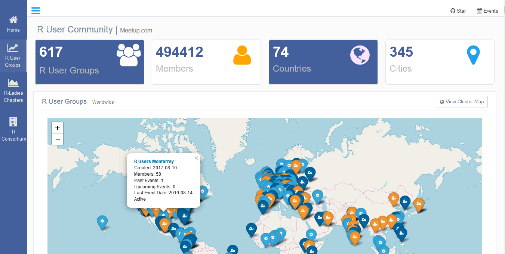
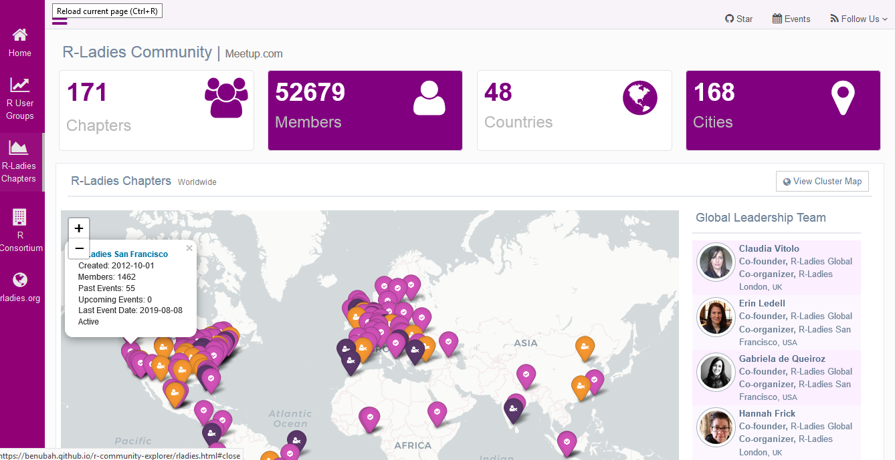
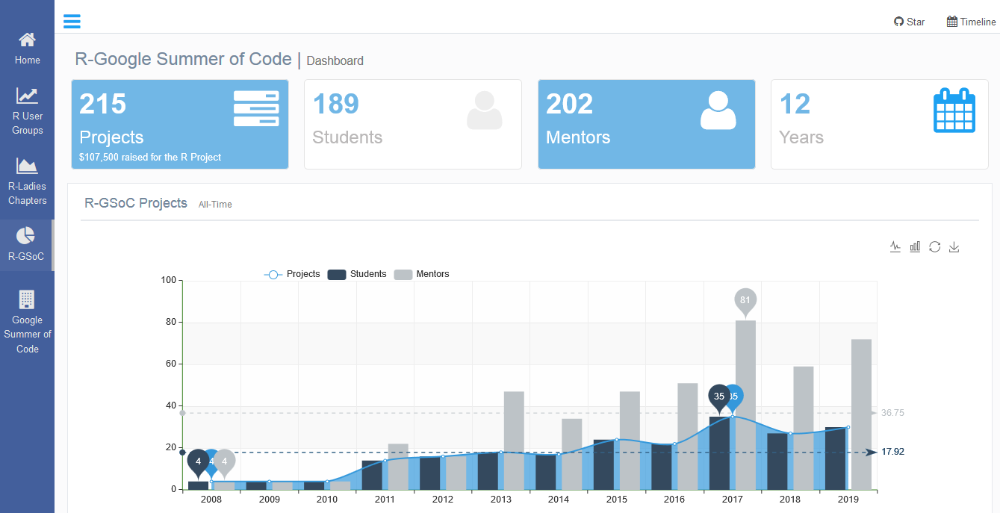
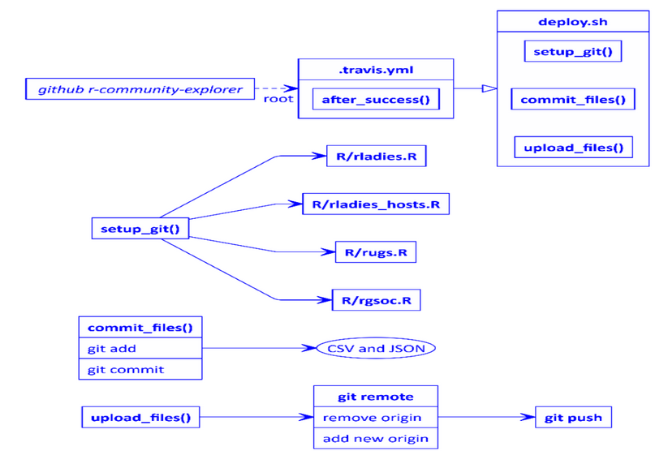

# R Community Explorer
Data-Driven Exploration of the R Community

This is an infrastructure to explore R user groups and R-Ladies groups around the world using a data-driven approach to render dashboards that summarize trends and insights to enhance better decision making for R centered organizations and the general community. **This work was originally a 2019 Google Summer of Code (GSoC) project by Ben Ubah (mentors Dr. Claudia Vitolo and Rick Pack).**

This hopefully makes it easier to find user groups, find upcoming events, discover active and inactive groups, track high profile groups based on activity and size, understand the global distribution of groups and bring to light, areas of under-representation.

The primary data source is the API of meetup.com. Additions of other sources remain planned.

This project uses the `meetupr` package to query the Meetup API. It renders the dashboards using Genetelella Admin Bootstrap Dashboard template.

It is completely data-driven and is updated daily by the use of Travis' Cron jobs.

## R User Groups Dashboard

https://benubah.github.io/r-community-explorer/rugs.html

## R-Ladies Dashboard

https://benubah.github.io/r-community-explorer/rladies.html

## R-Google Summer of Code Dashboard

https://benubah.github.io/r-community-explorer/gsoc.html

### Automatic dashboard updating with Travis CI
A simple diagram of how this project uses Travis CI to update the dashboards daily and automatically.

This UML diagram was developed on http://nomnoml.com/ and then published by github_UML.Rmd using the nomnoml R package.
